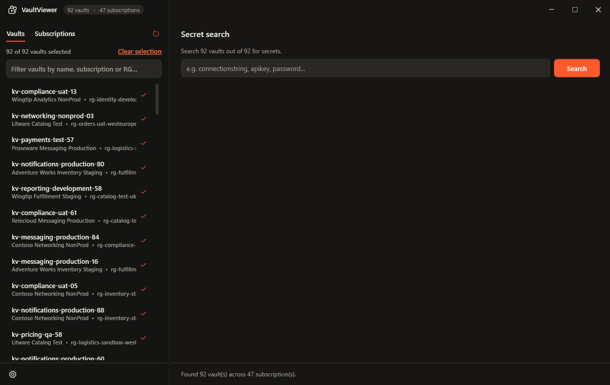
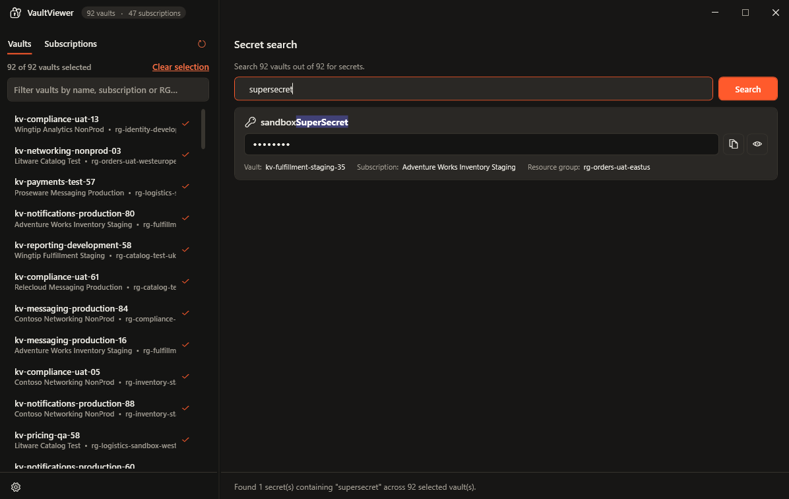
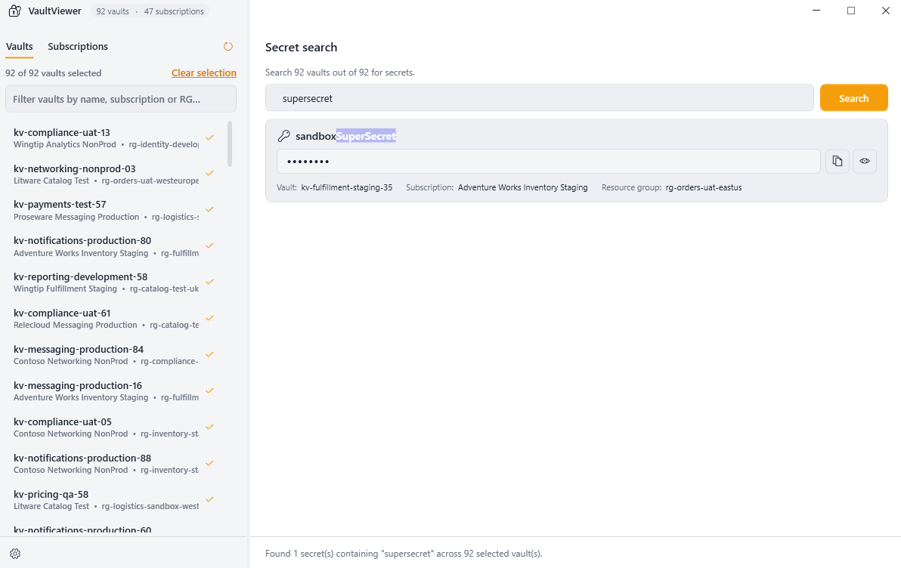

# VaultViewer

[](https://github.com/jxmoore/VaultViewer/actions/workflows/tests.yml)

VaultViewer is a lightweight Windows desktop app (.NET 8 / WPF) for browsing and
searching Azure Key Vault secrets across every subscription you have access to.
Point it at your Azure account and it discovers every vault up front — browsable
as a flat list or grouped by subscription — then lets you search secret **names**
globally, scanning every accessible vault in parallel. Secret *values* are never
fetched until you explicitly reveal or copy one. Light and dark themes are built
in, with full color/font customization.

<table>
  <tr>
    <td align="center"><br><sub>Vaults across every subscription</sub></td>
    <td align="center"><br><sub>Global secret search</sub></td>
    <td align="center"><br><sub>Light mode</sub></td>
  </tr>
</table>

## Authentication

Credentials are built by `DefaultCredentialFactory` as a two-link chain:

1. **`DefaultAzureCredential`** — tries, in order: environment variables →
   workload identity → managed identity → Visual Studio → **Azure CLI** → Azure
   PowerShell → Azure Developer CLI.
2. **`InteractiveBrowserCredential`** (fallback) — if nothing above is available,
   a browser sign-in opens. The token is cached (DPAPI on Windows), so the prompt
   only appears the first time.

The simplest path on a dev box is still:

```bash
az login
```

…but with no CLI installed the app falls back to the browser sign-in automatically.
Click **Refresh** if the app started before you signed in.

If your tenant blocks the default developer client used by the browser sign-in,
point it at your own Azure AD app registration (client ID + an
`http://localhost` redirect URI) via environment variables — no code change:

```bash
setx VAULTVIEWER_TENANT_ID <tenant-guid>
setx VAULTVIEWER_CLIENT_ID <app-client-id>
```

Your identity needs:
- **Reader** (or higher) on subscriptions to list vaults.
- A data-plane role such as **Key Vault Secrets User** / **Reader**, or an
  access-policy grant, on each vault to list and read secrets. Vaults you can't
  read are skipped silently during search.
